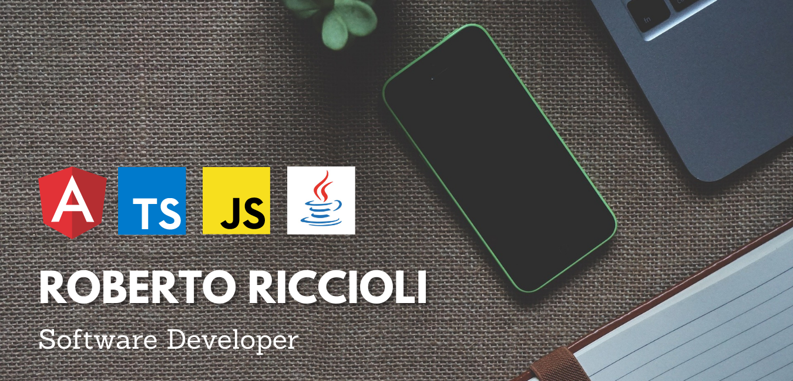

### Hi, I'm Roberto 👋:it:

Passionate software developer with a particular focus on Healthcare technologies. 

- 🔭 I’m currently working on Angular2, Typescript & Javascript  
      (I'm 70% front-end developer 😄)
       
- 🌱 I’m currently learning Java & MongoDB  
      (I would like to improve in back-end development 🤔)
       
- 📫 How to reach me: <a href="https://www.linkedin.com/in/riccioliroberto/">Linkedin Profile</a>.
      
     
 
<!--
**RiccioGit/RiccioGit** is a ✨ _special_ ✨ repository because its `README.md` (this file) appears on your GitHub profile.

Here are some ideas to get you started:

- 🔭 I’m currently working on ...
- 🌱 I’m currently learning ...
- 👯 I’m looking to collaborate on ...
- 🤔 I’m looking for help with ...
- 💬 Ask me about ...
- 📫 How to reach me: ...
- 😄 Pronouns: ...
- ⚡ Fun fact: ...
-->
